# TEMPL Pipeline Flow Diagrams

## **Diagram 1: Simple Pipeline Flow (Ideal Case - No Fallbacks)**

## **Diagram 2: Complete Pipeline Flow (With All Fallbacks)**

```mermaid
flowchart TD
    A[Start: Protein + Ligand Input] --> B[Generate Protein Embedding]
    B --> C[Find 100 Similar Templates<br/>KNN Search]
    C --> D{100 Templates Found?}
    D -->|No| C1[Use All Available Templates<br/>Fallback: No KNN Limit]
    D -->|Yes| E[Transform Templates<br/>Protein Alignment]
    C1 --> E
    
    E --> F[CA RMSD Filtering<br/>Progressive Fallback]
    F --> F1{10Å Threshold}
    F1 -->|Pass| G[Use 10Å Templates]
    F1 -->|Fail| F2{15Å Threshold}
    F2 -->|Pass| G1[Use 15Å Templates]
    F2 -->|Fail| F3{20Å Threshold}
    F3 -->|Pass| G2[Use 20Å Templates]
    F3 -->|Fail| G3[Final Fallback: Best Available<br/>Central Atom Positioning]
    
    G --> H[Find MCS<br/>RascalMCES]
    G1 --> H
    G2 --> H
    G3 --> H
    
    H --> I{MCS Found?}
    I -->|Yes| J[Constrained Embedding<br/>MCS-based Conformers]
    I -->|No| K[Central Atom Embedding<br/>Unconstrained Conformers]
    
    J --> L[Score & Rank Poses<br/>Shape/Color/Combo]
    K --> L
    
    L --> M{Conformers Generated?}
    M -->|Yes| N[Select Best Poses]
    M -->|No| O[Fallback: Single Conformer<br/>Minimal Processing]
    
    N --> P[Save Results<br/>SDF + Metadata]
    O --> P
    P --> Q[End: Pose Prediction Complete]
    
    style A fill:#e1f5fe,stroke:#01579b,stroke-width:2px,color:#000
    style Q fill:#e8f5e8,stroke:#2e7d32,stroke-width:2px,color:#000
    style D fill:#fff3e0,stroke:#e65100,stroke-width:2px,color:#000
    style F1 fill:#fff3e0,stroke:#e65100,stroke-width:2px,color:#000
    style F2 fill:#fff3e0,stroke:#e65100,stroke-width:2px,color:#000
    style F3 fill:#fff3e0,stroke:#e65100,stroke-width:2px,color:#000
    style I fill:#fff3e0,stroke:#e65100,stroke-width:2px,color:#000
    style M fill:#fff3e0,stroke:#e65100,stroke-width:2px,color:#000
    style J fill:#f3e5f5,stroke:#4a148c,stroke-width:2px,color:#000
    style K fill:#fff8e1,stroke:#f57f17,stroke-width:2px,color:#000
    style C1 fill:#ffebee,stroke:#c62828,stroke-width:2px,color:#000
    style G3 fill:#ffebee,stroke:#c62828,stroke-width:2px,color:#000
    style O fill:#ffebee,stroke:#c62828,stroke-width:2px,color:#000
```

## **Diagram 3: Detailed Fallback Decision Tree**

```mermaid
flowchart TD
    A[Template Finding] --> B[100 KNN Templates]
    B --> C{100 Found?}
    C -->|Yes| D[Proceed with 100]
    C -->|No| E[Use All Available]
    
    D --> F[CA RMSD Filtering]
    E --> F
    
    F --> G[10Å Threshold]
    G --> H{Pass?}
    H -->|Yes| I[Use 10Å Templates]
    H -->|No| J[15Å Threshold]
    
    J --> K{Pass?}
    K -->|Yes| L[Use 15Å Templates]
    K -->|No| M[20Å Threshold]
    
    M --> N{Pass?}
    N -->|Yes| O[Use 20Å Templates]
    N -->|No| P[Final Fallback:<br/>Best Available Template]
    
    I --> Q[MCS Finding]
    L --> Q
    O --> Q
    P --> Q
    
    Q --> R{MCS Found?}
    R -->|Yes| S[Constrained Embedding]
    R -->|No| T[Central Atom Embedding]
    
    S --> U[Conformer Generation]
    T --> U
    
    U --> V{Conformers Generated?}
    V -->|Yes| W[Scoring & Ranking]
    V -->|No| X[Single Conformer Fallback]
    
    W --> Y[Final Results]
    X --> Y
    
    style A fill:#e3f2fd,stroke:#0277bd,stroke-width:2px,color:#000
    style Y fill:#e8f5e8,stroke:#2e7d32,stroke-width:2px,color:#000
    style C fill:#fff3e0,stroke:#e65100,stroke-width:2px,color:#000
    style H fill:#fff3e0,stroke:#e65100,stroke-width:2px,color:#000
    style K fill:#fff3e0,stroke:#e65100,stroke-width:2px,color:#000
    style N fill:#fff3e0,stroke:#e65100,stroke-width:2px,color:#000
    style R fill:#fff3e0,stroke:#e65100,stroke-width:2px,color:#000
    style V fill:#fff3e0,stroke:#e65100,stroke-width:2px,color:#000
    style E fill:#ffebee,stroke:#c62828,stroke-width:2px,color:#000
    style P fill:#ffebee,stroke:#c62828,stroke-width:2px,color:#000
    style T fill:#ffebee,stroke:#c62828,stroke-width:2px,color:#000
    style X fill:#ffebee,stroke:#c62828,stroke-width:2px,color:#000
    style S fill:#f3e5f5,stroke:#4a148c,stroke-width:2px,color:#000
```

## **Color Legend:**
- **🔵 Blue**: Start/Input processes
- **🟢 Green**: End/Success states
- **🟠 Orange**: Decision points
- **🟣 Purple**: Constrained embedding (MCS-based)
- **🟡 Yellow**: Unconstrained embedding (central atom)
- **🔴 Red**: Fallback mechanisms
- **⚪ White**: Standard processes

## **Pipeline Fallback Summary:**

### **1. Template Finding Fallbacks:**
- **Primary**: Find 100 KNN templates
- **Fallback**: Use all available templates if <100 found

### **2. CA RMSD Filtering Fallbacks:**
- **Primary**: 10Å threshold
- **Fallback 1**: 15Å threshold
- **Fallback 2**: 20Å threshold
- **Final Fallback**: Best available template (central atom positioning)

### **3. MCS Finding Fallbacks:**
- **Primary**: Find MCS using RascalMCES
- **Fallback**: Central atom embedding when no MCS found

### **4. Conformer Generation Fallbacks:**
- **Primary**: Generate multiple conformers
- **Fallback**: Single conformer with minimal processing

### **5. Embedding Strategy:**
- **Constrained Embedding**: When MCS is found, use MCS-based conformer generation
- **Unconstrained Embedding**: When no MCS found, use central atom positioning

This robust fallback system ensures the TEMPL pipeline will always produce results, even in challenging cases where ideal conditions are not met. 