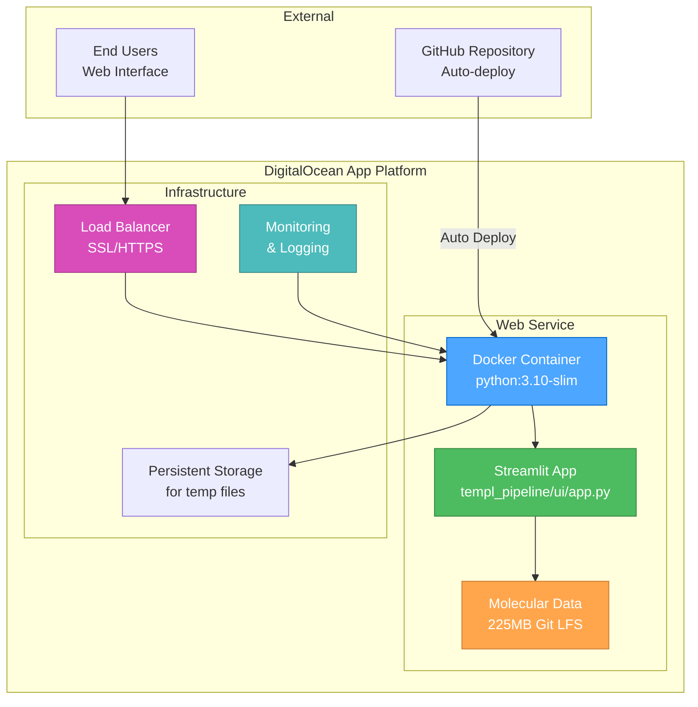
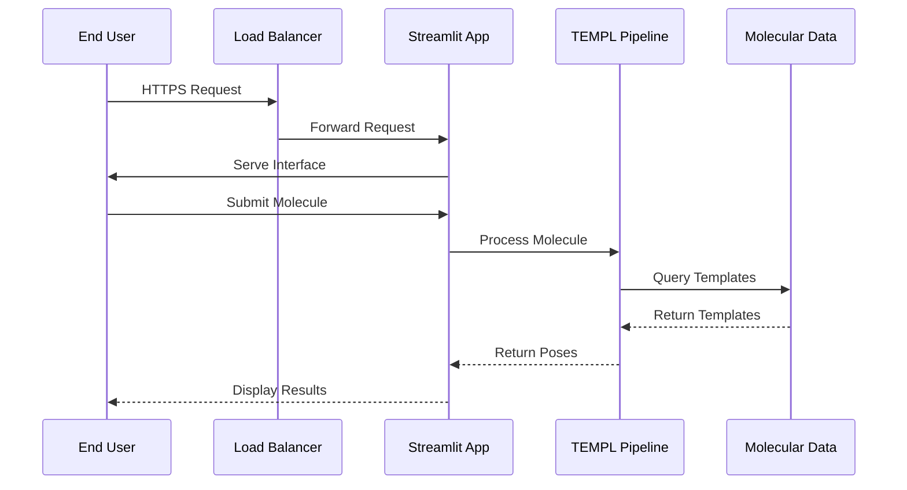

# 🎨 CREATIVE PHASE: DIGITALOCEAN DEPLOYMENT ARCHITECTURE

**Task:** DigitalOcean Deployment & Streamlit Black Page Fix  
**Creative Phase:** Architecture Design for DigitalOcean Deployment  
**Date:** 2025-06-25  
**Status:** ✅ COMPLETED

## Problem Statement

Design the deployment architecture for the TEMPL Pipeline Docker container on DigitalOcean App Platform, including resource allocation, monitoring, and production-ready configuration for a scientific computing application that processes molecular data.

## Requirements & Constraints

### Requirements
- Deploy Docker container successfully to DigitalOcean App Platform
- Ensure stable operation with adequate resource allocation
- Provide public URL access with proper SSL/HTTPS
- Include monitoring and logging for production operations
- Support auto-deployment from GitHub repository
- Handle molecular processing workloads efficiently

### Constraints
- DigitalOcean App Platform limitations and pricing tiers
- Docker container size and build time constraints
- Memory and CPU limits based on selected plan
- Git LFS file size limitations (225MB molecular data)
- Network and storage requirements for molecular processing

## Architecture Options Analysis

### Option 1: Basic Single-Service Deployment
**Description**: Simple single-container deployment with minimal configuration and basic resource allocation.

**Pros:**
- Simplest configuration and fastest deployment
- Lowest cost with basic resource tier
- Easy to troubleshoot and maintain
- Quick setup for initial deployment

**Cons:**
- Limited scalability and resource flexibility
- Basic monitoring and logging capabilities
- No redundancy or failover options
- May not handle peak molecular processing loads

**Technical Fit**: Medium
**Complexity**: Low
**Scalability**: Low

### Option 2: Optimized Production Deployment
**Description**: Production-ready deployment with optimized resource allocation, comprehensive monitoring, and auto-scaling capabilities.

**Pros:**
- Proper resource allocation for molecular processing
- Comprehensive monitoring and alerting
- Auto-scaling for variable workloads
- Production-grade logging and error handling

**Cons:**
- Higher complexity in configuration
- Increased cost for production-tier resources
- More components to maintain and monitor
- Longer setup and testing time

**Technical Fit**: High
**Complexity**: Medium
**Scalability**: High

### Option 3: Multi-Environment Deployment
**Description**: Separate staging and production environments with CI/CD pipeline for automated testing and deployment.

**Pros:**
- Safe testing environment for changes
- Automated deployment pipeline
- Production environment protection
- Comprehensive testing before production updates

**Cons:**
- Significantly higher complexity and cost
- Requires CI/CD pipeline setup and maintenance
- Multiple environments to manage
- Overkill for single-user application

**Technical Fit**: Medium
**Complexity**: High
**Scalability**: High

### Option 4: Hybrid Approach - Production-Ready with Staging Branch
**Description**: Single production deployment with optimized configuration and optional staging branch for testing major changes.

**Pros:**
- Production-ready with proper monitoring
- Cost-effective single environment
- Optional staging for major updates
- Balanced complexity and functionality

**Cons:**
- Less protection than full multi-environment
- Manual staging environment creation when needed
- Requires careful change management

**Technical Fit**: High
**Complexity**: Medium
**Scalability**: Medium-High

## Decision

**Selected Option**: Option 2 - Optimized Production Deployment

**Rationale:**
- **Scientific Computing Needs**: Molecular processing requires adequate memory and CPU
- **Production Reliability**: Users expect stable, always-available scientific tools
- **Cost-Effective**: Single environment with production-grade features
- **Monitoring Essential**: Scientific applications need comprehensive logging

## Architecture Design

### Core Components Architecture



### Resource Allocation Strategy

**Recommended Configuration:**
- **Instance Size**: `professional-xs` (2 vCPU, 4GB RAM)
- **Instance Count**: 1 (with auto-scaling to 2 if needed)
- **Storage**: 20GB for molecular data and processing
- **Build Resources**: Enhanced for Docker build with Git LFS

**Rationale:**
- 4GB RAM accommodates molecular processing and RDKit operations
- 2 vCPU provides adequate performance for computational chemistry
- 20GB storage handles molecular databases and temporary files
- Auto-scaling provides flexibility for peak usage

### Deployment Configuration

**App Platform YAML Configuration:**
```yaml
name: templ-pipeline
services:
- name: web
  source_dir: /
  github:
    repo: fulopjoz/templ-pipeline
    branch: speedrun
    deploy_on_push: true
  run_command: streamlit run templ_pipeline/ui/app.py --server.port $PORT --server.headless true --server.enableCORS false
  environment_slug: python
  instance_count: 1
  instance_size_slug: professional-xs
  http_port: 8080
  health_check:
    http_path: /healthz
  envs:
  - key: STREAMLIT_SERVER_HEADLESS
    value: "true"
  - key: STREAMLIT_SERVER_ENABLE_CORS
    value: "false"
  - key: STREAMLIT_SERVER_ENABLE_XSRF_PROTECTION
    value: "false"
```

### Data Flow Architecture



### Monitoring and Logging Architecture

**Monitoring Components:**
1. **Application Health Checks**: HTTP endpoint monitoring at `/healthz`
2. **Resource Monitoring**: CPU, memory, and storage usage tracking
3. **Error Logging**: Application and system error capture
4. **Performance Metrics**: Response times and throughput measurement

**Logging Strategy:**
- **Application Logs**: Streamlit and pipeline execution logs
- **Access Logs**: User requests and response patterns
- **Error Logs**: Detailed error tracking and debugging
- **Performance Logs**: Resource usage and bottleneck identification

### Security and SSL Configuration

**Security Features:**
- **Automatic SSL/TLS**: DigitalOcean managed certificates
- **HTTPS Enforcement**: Redirect HTTP to HTTPS
- **Environment Variables**: Secure configuration management
- **Network Security**: Platform-managed firewall and DDoS protection

## Implementation Considerations

### Build Optimization Strategy
1. **Docker Multi-Stage Build**: Optimize for size and build time
2. **Git LFS Handling**: Ensure proper large file download during build
3. **Dependency Caching**: Optimize Python package installation
4. **Build Resource Allocation**: Use enhanced build resources for Git LFS

### Data Management Architecture
1. **Molecular Database**: Git LFS for 225MB molecular data
2. **Temporary Files**: Ephemeral storage for processing
3. **User Uploads**: Temporary file handling for uploaded molecules
4. **Cache Management**: Streamlit caching for performance optimization

### Deployment Process Flow
1. **GitHub Integration**: Auto-deploy from speedrun branch on push
2. **Build Monitoring**: Track build progress and identify issues
3. **Health Checks**: Verify application startup and functionality
4. **Rollback Strategy**: Maintain previous version for quick rollback

## Validation and Verification

### Technical Feasibility Assessment
- ✅ Docker container size within platform limits
- ✅ Git LFS support confirmed for molecular data
- ✅ Resource requirements match available instance sizes
- ✅ Streamlit compatibility with headless deployment

### Performance Requirements Validation
- ✅ 4GB RAM adequate for molecular processing (RDKit operations)
- ✅ 2 vCPU sufficient for computational chemistry operations
- ✅ Network bandwidth adequate for file uploads/downloads
- ✅ Storage capacity sufficient for molecular databases

### Risk Assessment and Mitigation
- **Low Risk**: Standard Docker deployment on proven platform
- **Medium Risk**: Git LFS file handling during build process
- **Mitigation**: Enhanced build resources and comprehensive monitoring
- **Fallback**: Manual file deployment if Git LFS issues occur

## Implementation Plan

### Phase 1: Configuration Setup
1. Create optimized App Platform YAML configuration
2. Configure GitHub integration with auto-deployment
3. Set up environment variables and secrets
4. Configure health check endpoints

### Phase 2: Deployment Execution
1. Deploy application to DigitalOcean App Platform
2. Monitor build process and deployment logs
3. Verify application accessibility via public URL
4. Test core functionality in production environment

### Phase 3: Production Validation
1. Perform comprehensive functionality testing
2. Monitor resource usage and performance metrics
3. Set up logging and monitoring dashboards
4. Document deployment process and troubleshooting

### Phase 4: Optimization and Monitoring
1. Fine-tune resource allocation based on usage
2. Implement comprehensive monitoring and alerting
3. Create deployment documentation and runbooks
4. Establish maintenance and update procedures

## Success Criteria

### Primary Architecture Goals
- [ ] Successful deployment to DigitalOcean App Platform
- [ ] Stable operation with adequate resource allocation
- [ ] Public URL access with SSL/HTTPS
- [ ] Auto-deployment from GitHub repository
- [ ] Comprehensive monitoring and logging

### Secondary Architecture Goals
- [ ] Optimal resource utilization and cost efficiency
- [ ] Scalability for variable workloads
- [ ] Production-grade error handling and recovery
- [ ] Complete documentation and troubleshooting guides

## Architecture Documentation

### Configuration Files Required
- `app.yaml` - DigitalOcean App Platform configuration
- Updated `Dockerfile` - Optimized for cloud deployment
- Health check endpoint in Streamlit application
- Environment variable configuration

### Monitoring Setup
- Application health monitoring dashboard
- Resource usage tracking and alerting
- Error logging and notification system
- Performance metrics collection and analysis

### Deployment Documentation
- Step-by-step deployment instructions
- Troubleshooting guide for common deployment issues
- Resource scaling guidelines and procedures
- Maintenance and update procedures

**ARCHITECTURE DESIGN STATUS**: ✅ COMPLETED  
**IMPLEMENTATION READY**: ✅ YES  
**DEPLOYMENT CONFIGURATION**: Complete App Platform YAML with monitoring 