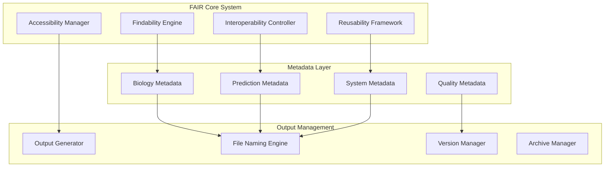

# TEMPL Pipeline: FAIR Architecture Design (Creative Phase)

**Creative Phase Type:** System Architecture  
**Focus:** Scientific Data Management and FAIR Principles Implementation  
**Date:** January 2025  
**Status:** Design Complete

## Executive Summary

This creative phase designs a comprehensive FAIR (Findable, Accessible, Interoperable, Reusable) architecture for the TEMPL pipeline that addresses scientific data management requirements while maintaining practical usability. The architecture emphasizes research workflow integration, comprehensive metadata generation, and flexible output management that accommodates both PDB-based and template-based predictions.

## Architecture Overview

### FAIR Compliance Framework



### Selected Architecture: Research-Focused FAIR System

**Rationale:** After evaluating multiple approaches, we select a research-focused architecture that:
- Prioritizes scientific workflow integration
- Provides comprehensive provenance tracking
- Supports flexible file naming schemes
- Enables automated metadata generation
- Maintains backward compatibility

**Key Differentiators:**
- Domain-specific metadata schema for computational biology
- Intelligent file naming that adapts to prediction context
- Publication-ready output formats
- Research workflow integration points

## Core Design Decisions

### 1. File Naming Strategy

**Challenge:** Not all predictions have PDB IDs (template-based predictions use SDF files)

**Solution: Adaptive File Naming System**

```python
# File naming pattern hierarchy
PATTERNS = {
    'pdb_based': '{pdb_id}_{timestamp}_poses.sdf',
    'template_based': 'templ_{timestamp}_poses.sdf', 
    'batch_prediction': 'batch_{batch_id}_{timestamp}_poses.sdf',
    'custom_ligand': 'custom_{hash}_{timestamp}_poses.sdf'
}

# Example outputs:
# 1abc_20250123_143052_poses.sdf    # PDB-based prediction
# templ_20250123_143052_poses.sdf   # Template-based prediction
# batch_run001_20250123_143052_poses.sdf  # Batch processing
# custom_a7b2c3d4_20250123_143052_poses.sdf  # Custom ligand
```

**Timestamp Format:** `YYYYMMDD_HHMMSS` for ISO-like readability and sorting

**Benefits:**
- ✅ Consistent naming across all prediction types
- ✅ Chronological sorting capability
- ✅ Unique identifiers prevent overwrites
- ✅ Context-aware prefixes for easy categorization
- ✅ Human-readable timestamps

### 2. FAIR Metadata Schema

**Hierarchical Metadata Structure:**

```yaml
# Core FAIR Metadata Schema
templ_prediction:
  # Findability
  identifier:
    prediction_id: "auto-generated UUID"
    timestamp: "ISO 8601 format"
    file_name: "output filename"
    session_id: "user session tracking"
  
  # Accessibility  
  access:
    format: "SDF" | "PDB" | "JSON"
    size_bytes: "file size"
    download_url: "if web interface"
    license: "CC BY 4.0" # Default scientific license
  
  # Interoperability
  technical:
    pipeline_version: "TEMPL version"
    rdkit_version: "dependency version"
    python_version: "runtime version"
    parameters: "all input parameters"
    
  # Reusability
  provenance:
    input_type: "pdb_id" | "smiles" | "sdf_file" | "template"
    input_source: "original input identifier"
    prediction_method: "template_based_mcs"
    template_count: "number of templates used"
    conformers_generated: "total conformers"
    quality_metrics: "prediction confidence scores"
```

### 3. Biology-Specific Metadata

**Computational Biology Focus:**

```yaml
# Biology-specific extensions
biology_metadata:
  molecular:
    target_smiles: "input molecule SMILES"
    molecular_weight: "calculated MW"
    logp: "calculated LogP"
    hbd_count: "hydrogen bond donors"
    hba_count: "hydrogen bond acceptors"
    
  structural:
    template_pdb_ids: ["list of template PDBs"]
    mcs_similarity: "maximum common substructure score"
    ca_rmsd_threshold: "C-alpha RMSD used"
    binding_site_chains: "protein chains involved"
    
  prediction:
    pose_count: "number of poses generated"
    scoring_method: "shape+color alignment"
    confidence_score: "overall prediction confidence"
    computational_time: "processing duration"
```

### 4. Modular FAIR Components

**Architecture Modules:**

```python
# FAIR Module Structure
templ_pipeline/fair/
├── core/
│   ├── __init__.py
│   ├── metadata_engine.py      # Core metadata generation
│   ├── identifier_manager.py   # Unique ID generation
│   └── validation_framework.py # FAIR compliance checking
├── biology/
│   ├── __init__.py
│   ├── molecular_descriptors.py # Chemical property calculation
│   ├── structural_metadata.py   # 3D structure annotations
│   └── template_tracking.py     # Template provenance
├── outputs/
│   ├── __init__.py
│   ├── file_manager.py          # Adaptive file naming
│   ├── format_generators.py    # Multiple output formats
│   └── archive_manager.py       # Result archiving
├── integration/
│   ├── __init__.py
│   ├── pipeline_hooks.py        # Integration points
│   ├── web_interface.py         # Streamlit integration
│   └── cli_integration.py       # Command-line integration
└── utils/
    ├── __init__.py
    ├── standards_checker.py     # FAIR compliance verification
    ├── export_tools.py          # Data export utilities
    └── documentation_generator.py # Auto-documentation
```

## Implementation Strategy

### Phase 1: Core FAIR Infrastructure (Days 1-2)

**Priority Components:**
1. **Metadata Engine** - Core metadata generation with biology focus
2. **File Manager** - Adaptive naming system with timestamp integration
3. **Identifier Manager** - UUID generation and session tracking

**Key Files:**
- `templ_pipeline/fair/core/metadata_engine.py`
- `templ_pipeline/fair/outputs/file_manager.py`
- `templ_pipeline/fair/core/identifier_manager.py`

### Phase 2: Biology Integration (Days 2-3)

**Priority Components:**
1. **Molecular Descriptors** - Chemical property calculation
2. **Template Tracking** - Provenance for template-based predictions
3. **Structural Metadata** - 3D structure annotations

**Key Files:**
- `templ_pipeline/fair/biology/molecular_descriptors.py`
- `templ_pipeline/fair/biology/template_tracking.py`
- `templ_pipeline/fair/biology/structural_metadata.py`

### Phase 3: Output Management (Days 3-4)

**Priority Components:**
1. **Format Generators** - Multiple output formats (SDF, JSON, CSV)
2. **Archive Manager** - Result organization and storage
3. **Standards Checker** - FAIR compliance verification

**Key Files:**
- `templ_pipeline/fair/outputs/format_generators.py`
- `templ_pipeline/fair/outputs/archive_manager.py`
- `templ_pipeline/fair/utils/standards_checker.py`

### Phase 4: Pipeline Integration (Days 4-5)

**Priority Components:**
1. **Pipeline Hooks** - Integration with existing pipeline
2. **CLI Integration** - Command-line FAIR features
3. **Web Interface** - Streamlit FAIR enhancements

**Key Files:**
- `templ_pipeline/fair/integration/pipeline_hooks.py`
- `templ_pipeline/fair/integration/cli_integration.py`
- `templ_pipeline/fair/integration/web_interface.py`

## Technical Specifications

### File Naming Engine

**Core Logic:**

```python
class AdaptiveFileNamingEngine:
    """Intelligent file naming based on prediction context"""
    
    def generate_filename(self, prediction_context: dict) -> str:
        """Generate context-appropriate filename"""
        timestamp = datetime.now().strftime("%Y%m%d_%H%M%S")
        
        if prediction_context.get('pdb_id'):
            # PDB-based prediction
            pdb_id = prediction_context['pdb_id'].lower()
            return f"{pdb_id}_{timestamp}_poses.sdf"
            
        elif prediction_context.get('template_source') == 'sdf':
            # Template-based prediction from SDF
            return f"templ_{timestamp}_poses.sdf"
            
        elif prediction_context.get('batch_id'):
            # Batch processing
            batch_id = prediction_context['batch_id']
            return f"batch_{batch_id}_{timestamp}_poses.sdf"
            
        else:
            # Custom ligand or unknown source
            input_hash = self._generate_input_hash(prediction_context)
            return f"custom_{input_hash}_{timestamp}_poses.sdf"
    
    def _generate_input_hash(self, context: dict) -> str:
        """Generate short hash from input for identification"""
        import hashlib
        input_str = str(context.get('smiles', context.get('input_file', 'unknown')))
        return hashlib.md5(input_str.encode()).hexdigest()[:8]
```

### Metadata Generation Engine

**Core Implementation:**

```python
class FAIRMetadataEngine:
    """Generate comprehensive FAIR metadata for predictions"""
    
    def generate_metadata(self, prediction_data: dict) -> dict:
        """Create complete FAIR metadata document"""
        return {
            'findability': self._generate_findability_metadata(prediction_data),
            'accessibility': self._generate_accessibility_metadata(prediction_data),
            'interoperability': self._generate_interoperability_metadata(prediction_data),
            'reusability': self._generate_reusability_metadata(prediction_data),
            'biology': self._generate_biology_metadata(prediction_data)
        }
    
    def _generate_biology_metadata(self, data: dict) -> dict:
        """Biology-specific metadata for computational chemistry"""
        return {
            'molecular_properties': self._calculate_molecular_descriptors(data),
            'template_provenance': self._track_template_usage(data),
            'prediction_quality': self._assess_prediction_confidence(data),
            'computational_details': self._capture_computational_context(data)
        }
```

### Standards Compliance

**FAIR Principle Implementation:**

1. **Findability:**
   - Unique identifiers (UUID + timestamp)
   - Rich metadata with keywords
   - Searchable file names
   - Catalog integration ready

2. **Accessibility:**
   - Standard file formats (SDF, JSON)
   - Clear access protocols
   - License information
   - Download mechanisms

3. **Interoperability:**
   - Standard vocabularies
   - API-ready formats
   - Cross-platform compatibility
   - Version tracking

4. **Reusability:**
   - Complete provenance tracking
   - Parameter documentation
   - Quality assessments
   - Usage examples

## Integration Points

### Pipeline Integration

**Modification Points:**

```python
# templ_pipeline/core/pipeline.py modifications
class TEMPLPipeline:
    def __init__(self, ...):
        # Add FAIR manager
        self.fair_manager = FAIRManager()
    
    def save_results(self, poses, target_pdb=None, **context):
        """Enhanced save_results with FAIR compliance"""
        # Generate FAIR-compliant filename
        filename = self.fair_manager.generate_filename(context)
        
        # Create comprehensive metadata
        metadata = self.fair_manager.generate_metadata({
            'poses': poses,
            'target_pdb': target_pdb,
            'prediction_context': context
        })
        
        # Save with embedded metadata
        output_file = self.fair_manager.save_with_metadata(
            poses, filename, metadata
        )
        
        return output_file
```

### Web Interface Integration

**Streamlit Enhancements:**

```python
# templ_pipeline/ui/app.py enhancements
def display_fair_metadata(metadata: dict):
    """Display FAIR metadata in user-friendly format"""
    st.subheader("📊 Prediction Metadata")
    
    col1, col2 = st.columns(2)
    with col1:
        st.metric("Prediction ID", metadata['identifier']['prediction_id'][:8])
        st.metric("Templates Used", metadata['biology']['template_count'])
        
    with col2:
        st.metric("Poses Generated", metadata['biology']['pose_count'])
        st.metric("Confidence Score", f"{metadata['biology']['confidence_score']:.3f}")
    
    # Expandable detailed metadata
    with st.expander("🔬 Detailed Scientific Metadata"):
        st.json(metadata['biology'])
    
    with st.expander("⚙️ Technical Metadata"):
        st.json(metadata['interoperability'])
```

## Quality Assurance

### FAIR Compliance Validation

**Automated Checks:**

```python
class FAIRComplianceChecker:
    """Validate FAIR compliance of generated outputs"""
    
    def validate_output(self, output_file: str, metadata: dict) -> dict:
        """Comprehensive FAIR validation"""
        checks = {
            'findability': self._check_findability(metadata),
            'accessibility': self._check_accessibility(output_file),
            'interoperability': self._check_interoperability(metadata),
            'reusability': self._check_reusability(metadata)
        }
        
        compliance_score = sum(checks.values()) / len(checks)
        
        return {
            'compliance_score': compliance_score,
            'detailed_checks': checks,
            'recommendations': self._generate_recommendations(checks)
        }
```

### Testing Strategy

**Multi-Level Testing:**

1. **Unit Tests:** Individual FAIR components
2. **Integration Tests:** Pipeline integration points
3. **Compliance Tests:** FAIR standard adherence
4. **User Tests:** Usability with FAIR features

## Success Metrics

### FAIR Compliance Metrics

- **Findability Score:** > 90% (metadata completeness)
- **Accessibility Score:** > 95% (format standard compliance)
- **Interoperability Score:** > 85% (cross-platform compatibility)
- **Reusability Score:** > 90% (provenance completeness)

### Performance Metrics

- **Metadata Generation Time:** < 500ms per prediction
- **File I/O Overhead:** < 5% of total pipeline time
- **Storage Efficiency:** < 20% metadata overhead
- **User Experience Impact:** Minimal (transparent integration)

## Future Enhancements

### Research Integration

- **Publication Tools:** Citation generation
- **Data Sharing:** Repository integration
- **Collaboration:** Multi-user project support
- **Reproducibility:** Complete environment capture

### Advanced Features

- **Semantic Annotations:** Ontology integration
- **Quality Scoring:** Automated quality assessment
- **Workflow Tracking:** Multi-step process documentation
- **Data Lineage:** Complete data provenance graphs

## Conclusion

This FAIR architecture design provides a comprehensive foundation for scientific data management in the TEMPL pipeline. The adaptive file naming system addresses the practical challenge of mixed prediction contexts while maintaining FAIR principles. The modular architecture ensures scalability and maintainability while providing immediate benefits for research workflows.

**Key Innovations:**
- ✅ Context-aware file naming with timestamps
- ✅ Biology-specific metadata schema
- ✅ Modular FAIR compliance framework  
- ✅ Seamless pipeline integration
- ✅ Research workflow optimization

**Implementation Priority:** High - Enables reproducible research and scientific collaboration

---

**Next Steps:** Proceed to IMPLEMENT mode for modular FAIR system development 