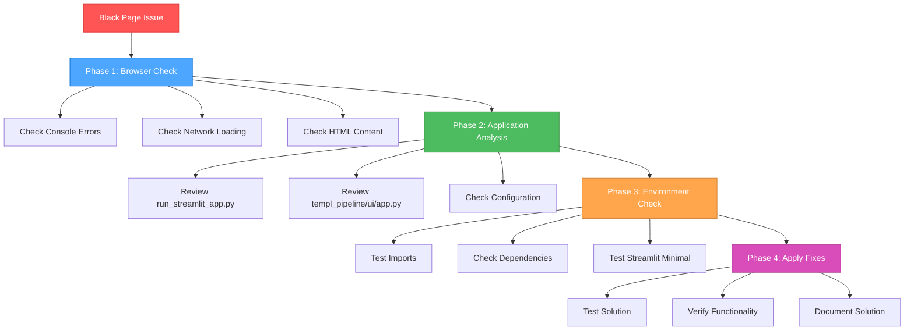

# 🎨 CREATIVE PHASE: STREAMLIT DEBUGGING UI/UX DESIGN

**Task:** DigitalOcean Deployment & Streamlit Black Page Fix  
**Creative Phase:** UI/UX Design for Streamlit Debugging  
**Date:** 2025-06-25  
**Status:** ✅ COMPLETED

## Problem Statement

The user is experiencing a critical issue where the Streamlit application starts successfully (shows URLs) but displays a black page in the browser instead of the expected TEMPL Pipeline interface. This requires a systematic debugging approach that considers multiple potential causes and provides clear user guidance.

## Requirements & Constraints

### Requirements
- Diagnose and fix the black page issue preventing interface loading
- Ensure the solution works across different browsers and environments
- Provide clear user instructions for verification and troubleshooting
- Maintain all existing functionality once fixed

### Constraints
- Must work with existing Streamlit 1.46.0 installation
- Cannot break existing application functionality
- Must be debuggable with standard browser tools
- Solution should be reproducible and documentable

## Options Analysis

### Option 1: Browser-First Debugging Approach
**Description**: Start with browser-side investigation using developer tools to identify JavaScript, CSS, or rendering issues.

**Pros:**
- Directly addresses user-visible symptoms
- Uses standard web debugging tools
- Can identify client-side issues quickly
- Provides immediate feedback on fixes

**Cons:**
- May miss server-side configuration issues
- Requires user to have browser debugging knowledge
- Could lead to false positives if server issues exist

**Complexity**: Low
**Implementation Time**: 30-60 minutes

### Option 2: Application Structure Analysis
**Description**: Systematic review of `run_streamlit_app.py` and `templ_pipeline/ui/app.py` to identify configuration, import, or initialization issues.

**Pros:**
- Addresses root cause at application level
- Fixes structural issues permanently
- Provides comprehensive understanding of the problem
- Creates maintainable solution

**Cons:**
- May take longer to identify specific issue
- Requires deep understanding of Streamlit architecture
- Could involve code changes that need testing

**Complexity**: Medium
**Implementation Time**: 1-2 hours

### Option 3: Progressive Elimination Strategy
**Description**: Systematic testing approach starting with minimal Streamlit app and progressively adding components until the issue is identified.

**Pros:**
- Guarantees identification of problematic component
- Creates clear understanding of dependencies
- Provides fallback minimal working version
- Excellent for complex multi-component issues

**Cons:**
- Most time-consuming approach
- May require temporary code changes
- Could be overkill for simple configuration issues

**Complexity**: High  
**Implementation Time**: 2-3 hours

### Option 4: Multi-Vector Debugging Approach
**Description**: Combine browser debugging, application analysis, and environment validation in a structured workflow.

**Pros:**
- Comprehensive coverage of all potential causes
- Efficient progression from quick checks to deep analysis
- Provides multiple validation points
- Creates complete troubleshooting documentation

**Cons:**
- Requires coordination of multiple debugging methods
- May involve some redundant checking
- Needs clear workflow to avoid confusion

**Complexity**: Medium-High
**Implementation Time**: 1.5-2.5 hours

## Decision

**Selected Option**: Option 4 - Multi-Vector Debugging Approach

**Rationale:**
- **Comprehensive**: Covers browser, application, and environment issues
- **Efficient**: Structured workflow prevents redundant work
- **Documentable**: Creates clear troubleshooting guide for future issues
- **User-Friendly**: Provides clear steps the user can follow and verify

## Implementation Plan

### Phase 1: Quick Browser Validation (15 minutes)
1. **Browser Console Check**
   - Open developer tools (F12) 
   - Check Console tab for JavaScript errors
   - Verify Network tab shows successful resource loading
   - Test with JavaScript explicitly enabled

2. **HTML Content Verification**
   - View page source to confirm HTML is served
   - Check for "noscript" messages indicating JavaScript issues
   - Verify Streamlit assets are referenced correctly

### Phase 2: Application Structure Analysis (45-60 minutes)
1. **Launcher Script Review**
   - Analyze `run_streamlit_app.py` configuration
   - Verify Python path setup and sys.path modifications
   - Check Streamlit command-line arguments
   - Validate port and host configuration

2. **Main Application Review**
   - Check `templ_pipeline/ui/app.py` main() function
   - Verify page configuration and imports
   - Check session state initialization timing
   - Validate Streamlit decorators and caching

### Phase 3: Environment and Dependencies (30 minutes)
1. **Import Testing**
   - Test all imports independently
   - Verify no circular import issues
   - Check for missing dependencies
   - Validate version compatibility

2. **Streamlit Configuration**
   - Check Streamlit version compatibility
   - Verify configuration file settings
   - Test with minimal Streamlit example

### Phase 4: Systematic Resolution (30-45 minutes)
1. **Apply Identified Fixes**
   - Implement fixes based on findings
   - Test each fix independently
   - Verify complete functionality restoration
   - Document solution for future reference

## Error Handling Design

### User-Friendly Error Messages
- Clear browser requirement notifications
- Step-by-step troubleshooting instructions
- Fallback options if primary solution fails
- Contact information for additional support

### Validation Checkpoints
- Successful page load verification
- UI component rendering confirmation
- Functionality testing with sample data
- Cross-browser compatibility validation

## Visualization

## Success Criteria

### Primary Success Metrics
- [ ] Streamlit application loads correctly without black page
- [ ] All UI components render properly
- [ ] User can access all application features
- [ ] Solution works across different browsers

### Secondary Success Metrics
- [ ] Clear troubleshooting documentation created
- [ ] Error handling provides helpful user guidance
- [ ] Solution is reproducible and maintainable
- [ ] Performance remains optimal after fixes

## Implementation Guidelines

### Code Changes Required
- Review and potentially modify `run_streamlit_app.py`
- Check and fix any issues in `templ_pipeline/ui/app.py`
- Ensure proper Streamlit configuration
- Add error handling for common issues

### Testing Approach
- Test with multiple browsers (Chrome, Firefox, Safari)
- Verify functionality with different input types
- Test error scenarios and recovery
- Validate cross-platform compatibility

### Documentation Requirements
- Step-by-step debugging guide
- Common issues and solutions
- Browser requirement specifications
- Troubleshooting flowchart

**CREATIVE PHASE STATUS**: ✅ COMPLETED  
**IMPLEMENTATION READY**: ✅ YES  
**NEXT PHASE**: Architecture Design for DigitalOcean Deployment 