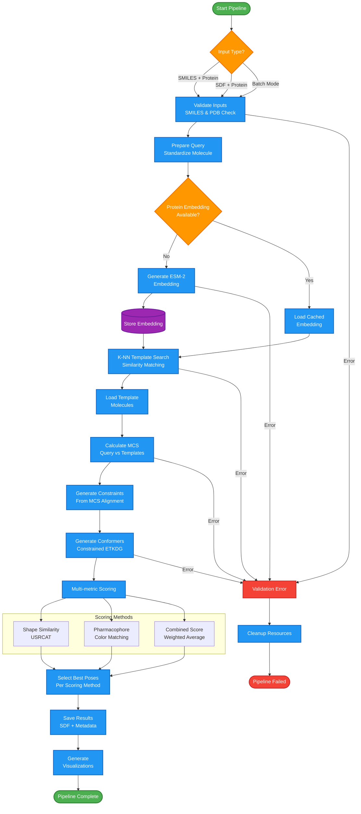
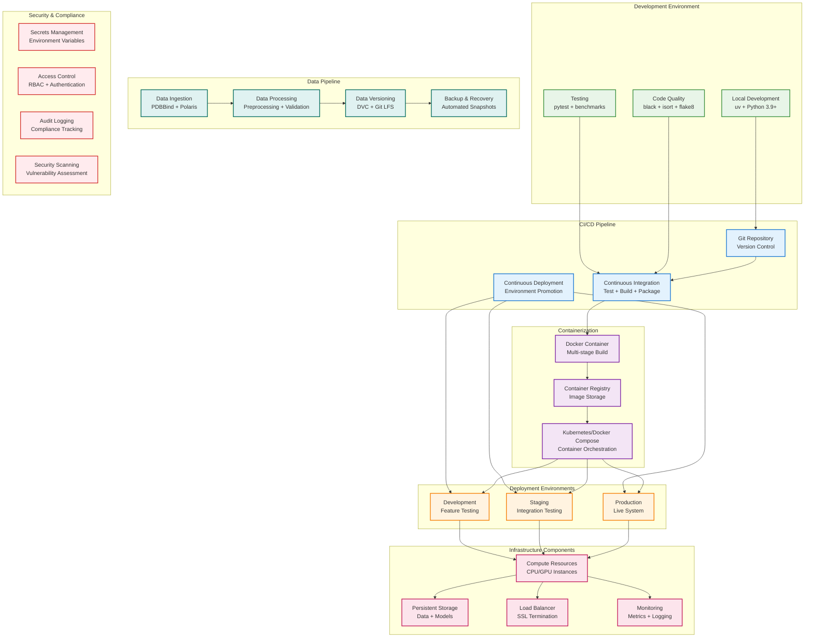

# TEMPL Pipeline - Architecture Diagram & Documentation

## Overview
TEMPL (Template-based Protein Ligand) is a pose prediction pipeline that leverages ligand similarity and template superposition for fast, accurate protein-ligand binding pose predictions. The system provides both CLI and web interfaces with a modular, scalable architecture.

---

## System Architecture Diagram

```mermaid
graph TB
    %% External Interfaces
    subgraph "User Interfaces"
        CLI[CLI Interface<br/>templ command]
        WEB[Web Application<br/>Streamlit UI]
        API[Python API<br/>Programmatic Access]
    end

    %% Entry Points
    subgraph "Application Entry Points"
        MAIN_CLI[run_pipeline.py<br/>CLI Entry Point]
        MAIN_WEB[run_streamlit_app.py<br/>Web Entry Point]
        SETUP[setup_templ_env.sh<br/>Environment Setup]
    end

    %% Core Pipeline
    subgraph "Core Pipeline Components"
        PIPELINE[TEMPLPipeline<br/>Main Orchestrator]
        
        subgraph "Processing Modules"
            EMBED[Embedding Manager<br/>ESM-2 Protein Embeddings]
            TEMPLATES[Template Engine<br/>K-NN Template Search]
            MCS[MCS Engine<br/>Maximum Common Substructure]
            CONFORMER[Conformer Generator<br/>Constrained ETKDG v3]
            SCORING[Scoring Engine<br/>Shape/Color/Combo Scoring]
        end
    end

    %% Data Layer
    subgraph "Data & Storage"
        PDBBIND[(PDBBind Database<br/>Protein-Ligand Complexes)]
        EMBEDDINGS[(Protein Embeddings<br/>Pre-computed ESM-2)]
        LIGANDS[(Processed Ligands<br/>Standardized SDF)]
        POLARIS[(Polaris Benchmark<br/>Validation Dataset)]
        OUTPUT[(Output Files<br/>SDF + Metadata)]
    end

    %% Supporting Services
    subgraph "Supporting Services"
        HARDWARE[Hardware Detection<br/>CPU/GPU/RAM Optimization]
        VALIDATION[Input Validation<br/>SMILES/PDB Validation]
        LOGGING[Logging System<br/>Progress Indicators]
        CONFIG[Configuration<br/>UX Adaptive Settings]
    end

    %% External Dependencies
    subgraph "External Dependencies"
        RDKIT[RDKit<br/>Chemical Informatics]
        BIOTITE[Biotite<br/>Structural Biology]
        TORCH[PyTorch<br/>ML Models]
        STREAMLIT[Streamlit<br/>Web Framework]
    end

    %% Flow Connections
    CLI --> MAIN_CLI
    WEB --> MAIN_WEB
    API --> PIPELINE
    
    MAIN_CLI --> PIPELINE
    MAIN_WEB --> PIPELINE
    
    PIPELINE --> EMBED
    PIPELINE --> TEMPLATES
    PIPELINE --> MCS
    PIPELINE --> CONFORMER
    PIPELINE --> SCORING
    
    EMBED --> EMBEDDINGS
    TEMPLATES --> PDBBIND
    TEMPLATES --> LIGANDS
    MCS --> RDKIT
    CONFORMER --> RDKIT
    SCORING --> RDKIT
    
    PIPELINE --> OUTPUT
    PIPELINE --> HARDWARE
    PIPELINE --> VALIDATION
    PIPELINE --> LOGGING
    
    %% Benchmark Connections
    POLARIS --> PIPELINE
    
    %% Styling
    classDef interface fill:#e1f5fe,stroke:#0277bd,stroke-width:2px
    classDef core fill:#f3e5f5,stroke:#7b1fa2,stroke-width:2px
    classDef data fill:#e8f5e8,stroke:#388e3c,stroke-width:2px
    classDef service fill:#fff3e0,stroke:#f57c00,stroke-width:2px
    classDef external fill:#fce4ec,stroke:#c2185b,stroke-width:2px
    
    class CLI,WEB,API interface
    class PIPELINE,EMBED,TEMPLATES,MCS,CONFORMER,SCORING core
    class PDBBIND,EMBEDDINGS,LIGANDS,POLARIS,OUTPUT data
    class HARDWARE,VALIDATION,LOGGING,CONFIG service
    class RDKIT,BIOTITE,TORCH,STREAMLIT external
```



---

## Pipeline Flow Diagram



---

## DevOps Architecture & Deployment



---

## Component Details

### Core Components

| Component | Purpose | Key Technologies | Scalability |
|-----------|---------|------------------|-------------|
| **TEMPLPipeline** | Main orchestrator | Python, asyncio | Horizontal via workers |
| **Embedding Manager** | Protein embeddings | ESM-2, PyTorch, CUDA | GPU acceleration |
| **Template Engine** | Similarity search | NumPy, scikit-learn | Vector databases |
| **MCS Engine** | Molecular alignment | RDKit, C++ bindings | Parallel processing |
| **Conformer Generator** | 3D structure gen | RDKit ETKDG | Multi-threading |
| **Scoring Engine** | Pose evaluation | USRCAT, pharmacophore | Vectorized ops |

### Interface Components

| Interface | Technology | Features | Deployment |
|-----------|------------|----------|------------|
| **CLI** | argparse, rich | Batch processing, scripting | Native executable |
| **Web App** | Streamlit | Interactive UI, visualizations | Container deployment |
| **Python API** | Direct imports | Programmatic access | Library package |

### Data Management

| Data Type | Format | Storage | Versioning |
|-----------|--------|---------|------------|
| **Protein Structures** | PDB | File system | Git LFS |
| **Ligand Database** | SDF | Compressed archives | Content hashing |
| **Embeddings** | NPZ | Binary files | Semantic versioning |
| **Benchmarks** | JSON/CSV | Version controlled | Data lineage |
| **Results** | SDF + metadata | Timestamped dirs | Automated archival |

---

## Deployment Strategies

### Development Setup
```bash
# Quick start with auto-detection
source setup_templ_env.sh

# Development with all features
source setup_templ_env.sh --dev

# Production minimal
source setup_templ_env.sh --minimal
```

### Container Deployment
```dockerfile
# Multi-stage build
FROM python:3.11-slim as builder
# ... build dependencies

FROM python:3.11-slim as runtime
# ... runtime configuration
EXPOSE 8501
CMD ["python", "run_streamlit_app.py"]
```

### Kubernetes Deployment
```yaml
apiVersion: apps/v1
kind: Deployment
metadata:
  name: templ-pipeline
spec:
  replicas: 3
  selector:
    matchLabels:
      app: templ-pipeline
  template:
    metadata:
      labels:
        app: templ-pipeline
    spec:
      containers:
      - name: templ-pipeline
        image: templ-pipeline:latest
        ports:
        - containerPort: 8501
        env:
        - name: STREAMLIT_SERVER_HEADLESS
          value: "true"
        resources:
          requests:
            memory: "4Gi"
            cpu: "2"
          limits:
            memory: "16Gi"
            cpu: "8"
```

---

## DevOps Best Practices Implemented

### 1. **Infrastructure as Code**
- Automated environment setup (`setup_templ_env.sh`)
- Hardware auto-detection and optimization
- Containerized deployment configurations

### 2. **Monitoring & Observability**
- Rich progress indicators and logging
- Performance metrics collection
- Error tracking and diagnostics

### 3. **Scalability & Performance**
- Multi-processing support with worker pools
- Hardware-aware resource allocation
- Caching for embeddings and templates

### 4. **Security**
- Input validation and sanitization
- Dependency scanning via `deptry`
- Minimal container surfaces

### 5. **Testing & Quality**
- Comprehensive test suite (`pytest`)
- Code formatting (`black`, `isort`)
- Linting and type checking (`flake8`, `mypy`)

### 6. **Documentation & UX**
- Progressive CLI interface
- Contextual help system
- User experience adaptation

---

## Performance Characteristics

### Typical Processing Times
- **Embedding Generation**: 30-120 seconds (protein size dependent)
- **Template Search**: 1-5 seconds (1000 templates)
- **Pose Generation**: 10-60 seconds (100-200 conformers)
- **Total Pipeline**: 1-3 minutes per query

### Resource Requirements
- **Minimum**: 4GB RAM, 4 CPU cores
- **Recommended**: 16GB RAM, 8+ CPU cores
- **GPU Acceleration**: 4GB+ VRAM for embeddings
- **Storage**: 2-10GB for datasets

### Scalability Limits
- **Concurrent Users**: 10-50 (web interface)
- **Batch Processing**: 100s-1000s molecules
- **Template Database**: Up to 100K structures
- **Memory Usage**: 2-8GB per pipeline instance

---

## Maintenance & Operations

### Regular Tasks
- **Database Updates**: Monthly PDBBind releases
- **Model Updates**: Quarterly embedding model updates
- **Performance Tuning**: Weekly optimization reviews
- **Security Patches**: Automated dependency updates

### Monitoring Metrics
- **Pipeline Success Rate**: >95% target
- **Average Processing Time**: <3 minutes
- **System Resource Usage**: <80% capacity
- **Error Rate**: <1% of requests

### Backup & Recovery
- **Data Backup**: Daily incremental, weekly full
- **Configuration Backup**: Git-based versioning
- **Disaster Recovery**: <4 hour RTO target
- **Data Retention**: 1 year for results, 5 years for datasets

---

*This diagram provides a comprehensive overview of the TEMPL Pipeline architecture, designed for clarity and operational understanding. The system follows modern DevOps practices with emphasis on scalability, maintainability, and user experience.* 