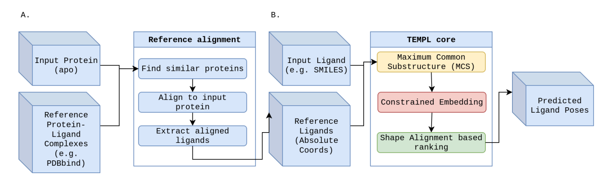

# TEMPL Core Workflow

The `templ_pipeline/core` package implements the template-based protein–ligand pose prediction workflow shown below.




For an interactive walkthrough that exercises these functions step by step, see [`templ_demo.ipynb`](templ_demo.ipynb).

For installation and CLI usage, refer to the project [root README](../README.md).

## Module Map

**Panel A – Reference Alignment**
- `embedding.py`
  - `EmbeddingManager` loads the protein embedding database and generates on-demand embeddings.
  - `get_protein_embedding()` extracts ESM-2 embeddings from a target PDB structure.
  - `select_templates()` finds the closest reference proteins using cosine similarity.
- `templates.py`
  - `load_reference_protein()` parses the target protein into a `biotite` atom array for downstream alignment.
  - `pdb_path()` / `ligand_path()` resolve template files on disk.
  - `transform_ligand()` aligns a template ligand into the target frame using the selected protein pair.

**Panel B – TEMPL Core**
- `chemistry.py` – `validate_target_molecule()` screens the ligand prior to pose generation.
- `mcs.py`
  - `find_mcs()` determines the maximum common substructure between the target ligand and each aligned template.
  - `constrained_embed()` generates conformers constrained to the MCS, with central-atom fallbacks when needed.
- `scoring.py`
  - `score_and_align()` performs shape/feature alignment between poses and templates.
  - `select_best()` ranks generated poses using the combined scoring metric.

**Pipeline Orchestration and Utilities**
- `pipeline.py` provides `PipelineConfig`, `TEMPLPipeline`, `run_pipeline()`, and `run_from_pdb_and_smiles()` to assemble the end-to-end workflow.
- Supporting modules (`output_manager.py`, `execution_manager.py`, `workspace_manager.py`, `file_manager.py`, `hardware.py`, `validation.py`) handle logging, resource management, workspace layout, and diagnostics.

## Panel A + Panel B Walkthrough

```python
from pathlib import Path
from rdkit import Chem

from templ_pipeline.core import (
    EmbeddingManager,
    select_templates,
    load_reference_protein,
    ligand_path,
    pdb_path,
    transform_ligand,
    validate_target_molecule,
    find_mcs,
    constrained_embed,
    select_best,
)

DATA_DIR = Path("data")
TARGET_PDB = DATA_DIR / "example" / "1iky_protein.pdb"
TARGET_SMILES = "COc1ccc(C(C)=O)c(O)c1[C@H]1C[C@H]1NC(=S)Nc1ccc(C#N)cn1"

# Panel A – embeddings and aligned templates
manager = EmbeddingManager(embedding_path=str(DATA_DIR / "embeddings" / "templ_protein_embeddings_v1.0.0.npz"))
target_embedding, chain_ids = manager.get_embedding("1IKY", pdb_file=str(TARGET_PDB))
template_hits = select_templates(
    target_pdb_id="1IKY",
    target_embedding=target_embedding,
    k=5,
    similarity_threshold=0.7,
    return_similarities=True,
    allow_self_as_template=True,
)
top_template_id, similarity = template_hits[0]
reference_structure = load_reference_protein(str(TARGET_PDB))
template_supplier = Chem.SDMolSupplier(ligand_path(top_template_id), removeHs=False)
template_ligand = next(m for m in template_supplier if m is not None)
aligned_template = transform_ligand(
    mob_pdb=pdb_path(top_template_id),
    lig=template_ligand,
    pid=top_template_id,
    ref_struct=reference_structure,
)

# Panel B – constrained embedding and pose ranking
target_mol = Chem.AddHs(Chem.MolFromSmiles(TARGET_SMILES))
validate_target_molecule(target_mol, mol_name="demo_ligand", pdb_id="1IKY")
_, mcs_smarts, _ = find_mcs(target_mol, [aligned_template], return_details=True)
poses = constrained_embed(target_mol, aligned_template, mcs_smarts, n_conformers=5)
ranked_poses = select_best(poses, aligned_template, return_all_ranked=True)
print(ranked_poses[0][1])  # Combined shape/color scores for the top pose
```

The demo notebook (`templ_demo.ipynb`) executes the same sequence so you can inspect intermediate molecules and scores interactively.

## Pipeline Entry Points

```python
from templ_pipeline.core import run_from_pdb_and_smiles

run_from_pdb_and_smiles(
    pdb_id="1iky",
    smiles="COc1ccc(C(C)=O)c(O)c1[C@H]1C[C@H]1NC(=S)Nc1ccc(C#N)cn1",
    output_dir="output/templ_demo_notebook",
)
```

```python
from templ_pipeline.core import PipelineConfig, run_pipeline

config = PipelineConfig(
    target_pdb="data/example/1iky_protein.pdb",
    target_smiles="COc1ccc(C(C)=O)c(O)c1[C@H]1C[C@H]1NC(=S)Nc1ccc(C#N)cn1",
    output_dir="output/templ_demo_notebook",
    data_dir="data",
    n_confs=50,
    n_workers=2,
    sim_threshold=0.7,
    ca_rmsd_threshold=10.0,
)
run_pipeline(config)
```

Both helpers write pose files, JSON summaries, and runtime metadata to the specified output directory. The latest results are summarised at the end of `templ_demo.ipynb`.
